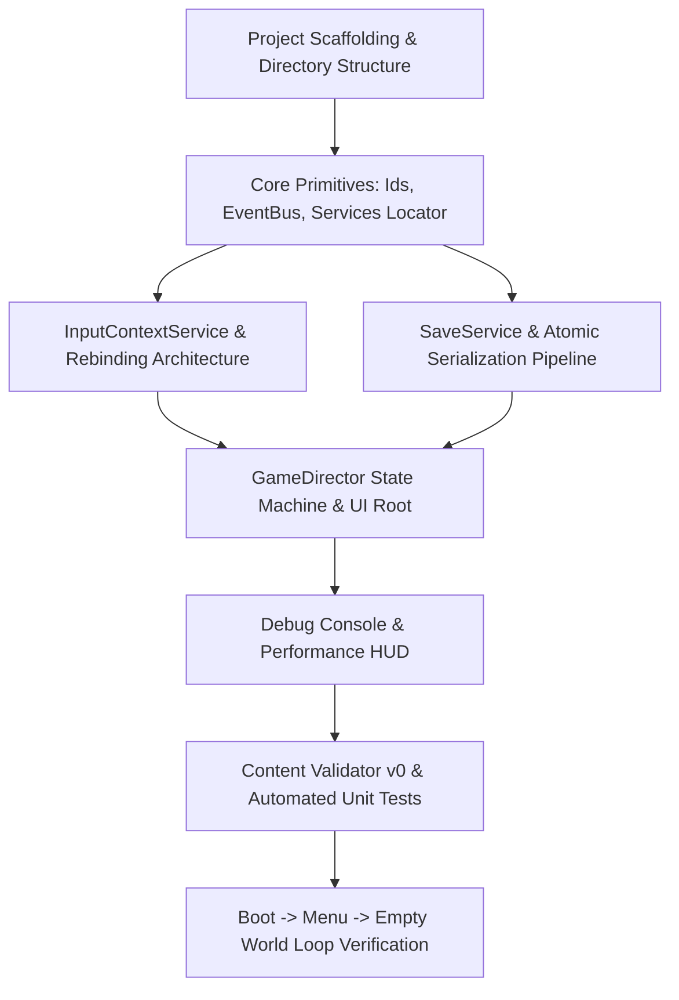

# Project Meridian — Game Architecture & Systems Review

**Date:** July 5, 2026  
**Status:** Reviewed & Approved for Phase 0 Execution  
**Audience:** Development Team & Autonomous Coding Agents  

---

## 1. Executive Summary & Architectural Evaluation

The **Project Meridian Game Architecture & Systems Design Document (v1.0)** establishes a rigorous, theme-agnostic framework for a 3D third-person open-world action RPG engine built in **Godot 4.6 (.NET 8 / C#)**. 

The architecture successfully reconciles two historically conflicting game development goals:
1. **Deep Systemic Interaction:** Combining Cyberpunk 2077-style mechanical depth (vehicles, third-person shooting, modular inventory/upgrades, stat-point progression) with Witcher 3-style world reactivity (branching dialogue, reputation, dynamic day/night and weather cycles).
2. **Solo / Small-Team Sustainability:** Enforcing strict data-driven design patterns so that post-launch content expansion requires **zero modifications to core C# systems code** ("new files + one index entry, zero edits to existing C#").

### Key Strengths of the Architecture
- **Strict Decoupling via Layering:** The separation of **Data Layer** (immutable Godot `Resource` definitions), **Domain Layer** (plain C# classes with zero Godot Node inheritance for testability and simulation logic), **Scene Layer** (visual presentation and physical simulation), and **Services** (global autoload coordinators) prevents spaghetti dependencies.
- **The "Definition vs. Instance" Rule:** Godot resources are shared by reference. By strictly pairing immutable Resource definitions (`WeaponResource`, `ItemResource`) with plain C# runtime instances (`WeaponInstance`, `ItemInstance`), the architecture eliminates shared-state mutation bugs and dramatically simplifies save game serialization.
- **Unified Mathematical & Action Pipelines:** Rather than each subsystem implementing bespoke logic, the framework unifies cross-cutting concerns:
  - **One Modifier System:** Perks, gear, weather, and status effects all feed through a single modifier math engine.
  - **One Damage Pipeline:** All combat interactions (hitscan, projectile, melee, vehicle collisions) route through `IDamageable` and ordered mitigation rules.
  - **Shared Vocabulary:** `ConditionResource` and `GameActionResource` provide a declarative scriptable language shared by quests, dialogue, interactables, and scheduled world events.
- **Proactive Performance Budgeting:** Designing around a strict **16.6 ms (60 fps)** frame budget with time-sliced asynchronous world streaming, ring-based LODs, and zero steady-state per-frame garbage collection allocations ensures that open-world scale does not collapse under runtime overhead.

---

## 2. Technical Decisions & Refinements for Execution

In accordance with Section 22 ("Maintain a short architecture decision record when reality forces a deviation or refinement"), the following technical baselines have been established for Phase 0 execution:

### 2.1 C# & Godot .NET Setup
- **Target Framework:** `.NET 8.0` with `LangVersion` set to `latest` (C# 12/13 features including primary constructors, records, and collection expressions).
- **Nullability & Quality:** `<Nullable>enable</Nullable>`, `<WarningsAsErrors>true</WarningsAsErrors>` enforced at the solution level (`Directory.Build.props`).
- **Source Generation:** Strict adherence to `partial class` definitions for all Godot-derived nodes and resources to support Godot 4.6 source generators and `System.Text.Json` compile-time serialization contexts.

### 2.2 EventBus Architecture
- **Design:** Hand-rolled typed publish/subscribe bus in plain C# (`Meridian.Core.EventBus`).
- **Memory Safety:** To eliminate the classic Godot failure mode of dangling references to freed Nodes, subscriptions return an `IDisposable` token. A strict project rule is enforced: **any Node subscribing to the EventBus must store its subscription tokens and dispose them in `_ExitTree()`**.

### 2.3 Serialization & Save Engine
- **Engine:** `System.Text.Json` with source-generated serialization contexts (`SaveJsonContext`) for zero-reflection, trimming-safe performance.
- **Custom Converters:** Custom JSON converters for Godot mathematical structures (`Vector3`, `Vector2`, `Basis`, `Transform3D`, `Color`, `StringName`).
- **Atomic File I/O:** Saves are written to a temporary file (`.tmp`), flushed to disk, and atomically renamed over the destination slot, with automatic `.bak` rotation to prevent corruption during unexpected shutdowns or crashes.

### 2.4 Content Validation Engine
- A dedicated headless validation engine (`Meridian.Core.Validation.ContentValidator`) runs at boot and via editor/debug commands to verify all asset registries, orphan files, ID uniqueness, and cross-resource references before content errors manifest at runtime.

---

## 3. Phase 0 Implementation Roadmap

Phase 0 delivers the "Walking Skeleton" — the foundational scaffolding that proves out the architecture, CI/test pipeline, and core services before gameplay mechanics are introduced in Phase 1.

### Phase Deliverables Status
* **[COMPLETED] Phase 0: Foundations:** Core project scaffolding, EventBus, Services locator, atomic SaveService skeleton, GameDirector state machine, PerfHUD, DebugConsole, and ContentValidator.
* **[COMPLETED] Phase 1: On-Foot Core:** Character locomotion motor, state machine (Grounded/Airborne/Crouch/Sprint), aim camera interpolation, StatBlocks, and damage mitigation target dummy.
* **[COMPLETED] Phase 2: Items & Weapons:** Stacking inventory containers, equipment slots, atomic transaction service, hitscan weapon controller, and upgrade bench.
* **[COMPLETED] Phase 3: World & Streaming:** Cell loader interface, WorldStateStore deltas persistence, and WorldStreamerNode active/simulated/visual streaming rings.
* **[COMPLETED] Phase 4: Vehicles v1:** Boarding/unboarding possession swap interface, handling profiles, fuel burn rates, and braking controls.
* **[COMPLETED] Phase 5: Time & Weather v1:** ScheduledEventRunner event tracking, WeatherProfile resources, and dynamic weather stat modifier pushes.
* **[COMPLETED] Phase 6: Quests, Dialogue & NPC Life:** QuestManager objective evaluations, DialogueService branching conversations, and NpcLifeController hourly routines.

---

## 4. Architectural Patterns: Decoupled Headless Testing

To solve the native crash issues typical in C# Godot unit testing (where instantiating any class derived from `Godot.Resource` or `Godot.Node` outside the running engine triggers a native backing exception), we enforce the **Interface-based Decoupling Pattern**:

- **Domain Models Consume Interfaces:** Inventory and combat logic consume interfaces (`IItemDefinition`, `IEquippableBehavior`, `IWeaponDefinition`) instead of writing direct dependencies on concrete Godot Resource classes (`ItemResource`, `WeaponResource`).
- **Resource Classes Implement Interfaces:** Concrete Godot resources inherit from `Godot.Resource` and implement their respective interface. They are used solely as serialized data containers in the editor.
- **Pure C# Mocks in Unit Tests:** Headless unit tests instantiate pure C# mock classes (`BasicItemDefinition`, `BasicWeaponDefinition`) implementing the interfaces, allowing complete testing of inventory math, transactions, and combat pipelines in under 40 milliseconds without native Godot engine boots.

